---
---
title: High-Level Systems Overview
---
flowchart LR
    UI@{ shape: curv-trap, label: "Frontend UI"}
    API[Backend Service Layer]
    DB[(SQLite Database)]
    Excel@{ shape: doc, label: "Excel Files" }
    Email@{ shape: docs, label: "Email System"}
    Staging[Staging Tables]
    Error{{Error Handler}}

    UI --|API Call|--> API
    API --|SQL Query|--> DB
    Excel --|File Upload|--> Staging
    Email --|Email Import|--> Staging
    Staging --|Batch Submission|--> API

    %% Error handling for each transfer type
    UI -. failure .-> Error
    API -. failure .-> Error
    Excel -. failure .-> Error
    Email -. failure .-> Error
    Staging -. failure .-> Error
    DB -. failure .-> Error

    %% Optional: return lines for retry or notification (not shown for clarity)

    %% (Dashed "failure" lines show error handling for each transfer)

---
title: UI Data Flow (Interactive)
---
flowchart LR
    User[User]
    UI[Frontend UI]
    API[Backend Service]
    DB[(SQLite)]
    Audit[Audit Records]

    User -- "performs action" --> UI
    UI -- "sends request" --> API
    API -- "query/update data" --> DB
    API -- "writes audit log" --> Audit

---
title: Excel Import Flowcharts
---
%% Improved, detailed Excel Import Flow
flowchart LR
    Start{{"Start"}}
    ExcelFile[/Excel File/]
    Staging2["Parse & Stage Data"]
    API2{{"Validation Back-End Services"}}
    DB2[(SQLite)]
    Audit2[(Audit Log)]
    Review2(["Manual Review"])
    Start --> ExcelFile
    ExcelFile -- "Upload .xlsx" --> Staging2
    Staging2 -- "Parsed rows" --> API2
    API2 -- "Valid ✔" --> DB2
    API2 -- "Log Entry" --> Audit2
    API2 -- "Conflict ✖" --> Review2
    Review2 -- "Resolve & re-submit" --> API2

---
title: Email Ingestion Flow (Improved)
---
flowchart LR
    Start{{"Start"}}
    EmailIn["/Incoming Email/"]
    Parser["Parse Email"]
    Staging["Stage Parsed Data"]
    Validation{{"Validate & Classify (Back-End)"}}
    DB[(SQLite)]
    Audit[(Audit Log)]
    Review("/Manual Review/")

    Start --> EmailIn
    EmailIn -- "Receive" --> Parser
    Parser -- "Extract & Format" --> Staging
    Staging -- "Place in Queue" --> Validation
    Validation -- "Valid" --> DB
    Validation -- "Log Action" --> Audit
    Validation -- "Ambiguous" --> Review
    Review -- "Resolved/Clarified" --> Validation

